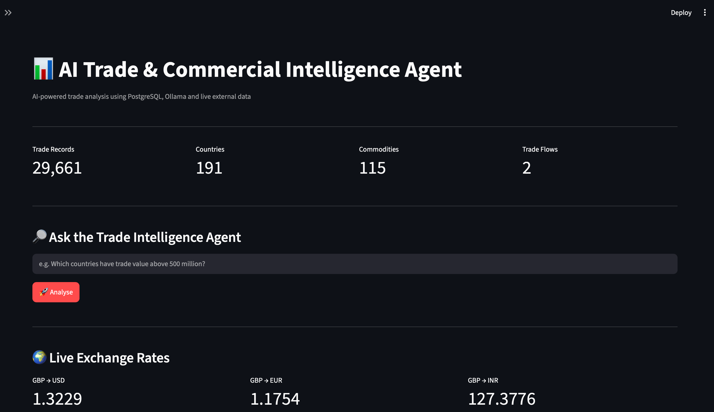
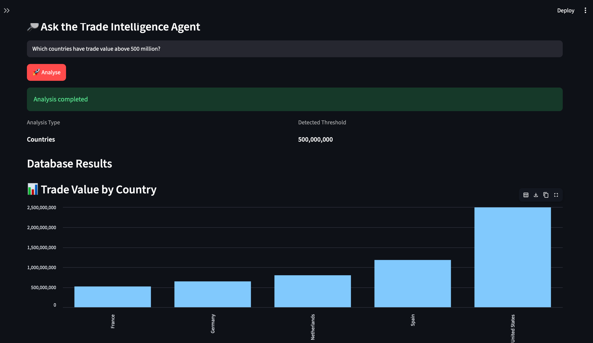
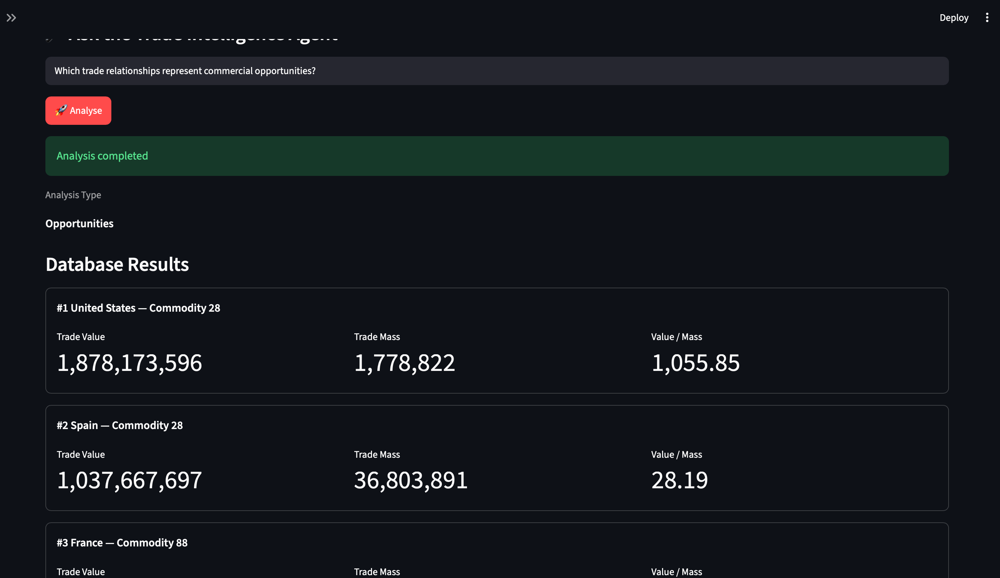

cat > README.md <<'EOF'
# AI Trade & Commercial Intelligence Agent

An AI-powered trade intelligence system combining **PostgreSQL, Python, Ollama/Qwen 3, and live external data** to analyse countries, commodities, trade flows, and commercial opportunities.

## 🚀 Features

- Natural-language business questions
- PostgreSQL analytical functions and views
- AI agent using local **Ollama / Qwen 3**
- Commercial opportunity identification
- Country and commodity trade analysis
- Trade-flow analysis
- Value-per-mass analysis
- Live GBP exchange-rate data
- Interactive Streamlit dashboard
- No paid LLM API required

## 🏗️ Architecture

User Question  
↓  
Ollama / Qwen 3  
↓  
Python AI Agent  
↓  
PostgreSQL  
↓  
Analytical Functions & Views  
↓  
Business Intelligence Results

## 📸 Application Screenshots

### Dashboard Overview


### Country Trade Analysis


### Commercial Opportunity Analysis


## 🛠️ Technology Stack

- Python
- PostgreSQL
- SQL
- Ollama / Qwen 3
- Streamlit
- Pandas
- psycopg
- REST APIs

## 📊 Data Scope

- **29,661** trade records
- **191** countries
- **115** commodities
- **2** trade flows
- Data covering **2025–2026**

## 💡 Example Questions

- Which countries have trade value above 500 million?
- Which commodities have the highest trade value?
- Which trade relationships represent commercial opportunities?
- Which trade flows have the highest value?
- What are the current GBP exchange rates?

## 📈 Commercial Intelligence

The system identifies trade relationships based on configurable thresholds for:

- Total trade value
- Trade volume
- Value per unit of mass
- Country
- Commodity
- Trade flow

## 🖥️ Run Locally

Install dependencies:

```bash
pip install -r requirements.txt
